# Домашнее задание «Запуск приложений в K8S»

## Цель задания

В тестовой среде для работы с Kubernetes необходимо развернуть Deployment с приложением, состоящим из нескольких контейнеров, и масштабировать его.

## Выполнение заданий

### Подготовка среды

Проверка готовности Kubernetes кластера:

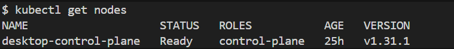

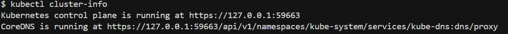

## Задание 1. Создать Deployment и обеспечить доступ к репликам приложения из другого Pod

### 1.1 Создать Deployment приложения, состоящего из двух контейнеров — nginx и multitool

Создан Deployment с двумя контейнерами:
- nginx (bitnami/nginx) на порту 8080
- multitool (wbitt/network-multitool) на порту 8081

Манифест: [manifests/task1-deployment.yaml](manifests/task1-deployment.yaml)

**Решенная ошибка:** Изначально возникла проблема с загрузкой образов из Docker Hub. Было решено заменить `nginx:1.25` на `bitnami/nginx` и настроить порты через переменные окружения.

### 1.2 Увеличить количество реплик работающего приложения до 2

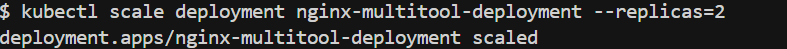

### 1.3 Продемонстрировать количество подов до и после масштабирования

До масштабирования: 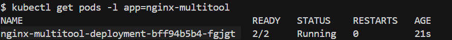

После масштабирования: 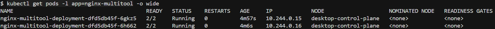

### 1.4 Создать Service, который обеспечит доступ до реплик приложений

Создан Service с двумя портами:
- 8080 для nginx
- 8081 для multitool

Манифест: [manifests/task1-service.yaml](manifests/task1-service.yaml)

Информация о Service: 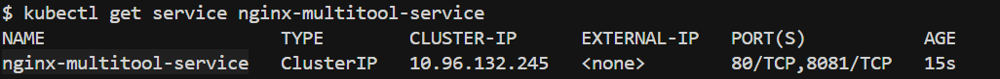

### 1.5 Создать отдельный Pod с приложением multitool и проверить доступ через curl

Создан тестовый Pod: [manifests/task1-test-pod.yaml](manifests/task1-test-pod.yaml)

Тестирование доступа к nginx: 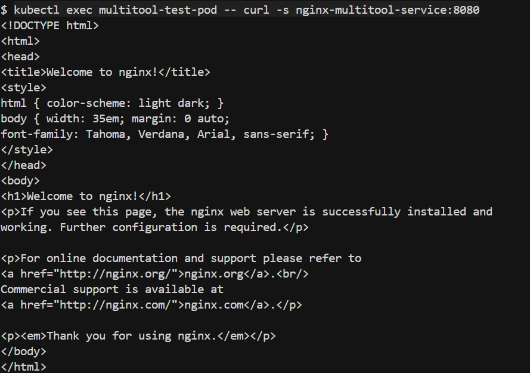

Тестирование доступа к multitool: 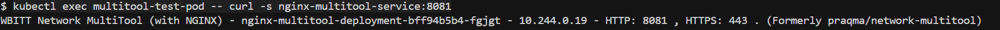

## Задание 2. Создать Deployment и обеспечить старт основного контейнера при выполнении условий

### 2.1 Создать Deployment приложения nginx с Init-контейнером

Создан Deployment с:
- Init-контейнером busybox, который ждет доступности сервиса `nginx-init-service`
- Основным контейнером nginx, который запускается только после успешного завершения Init-контейнера

Манифест: [manifests/task2-deployment.yaml](manifests/task2-deployment.yaml)

### 2.2 Убедиться, что nginx не стартует без сервиса

Состояние пода до создания Service: 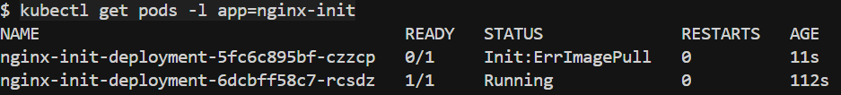

Логи Init-контейнера (ожидание сервиса): 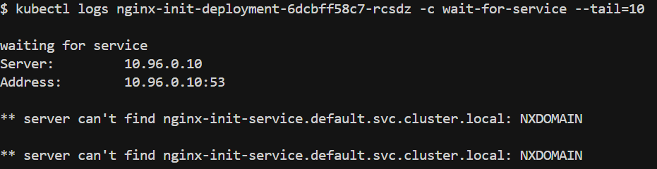

### 2.3 Создать и запустить Service

Создан Service для nginx-init приложения: [manifests/task2-service.yaml](manifests/task2-service.yaml)

### 2.4 Продемонстрировать состояние пода до и после запуска сервиса

Состояние пода после создания Service: [screenshots/11_task2_pod_after_service.txt](screenshots/11_task2_pod_after_service.txt)

Логи Init-контейнера после создания Service (сервис найден): 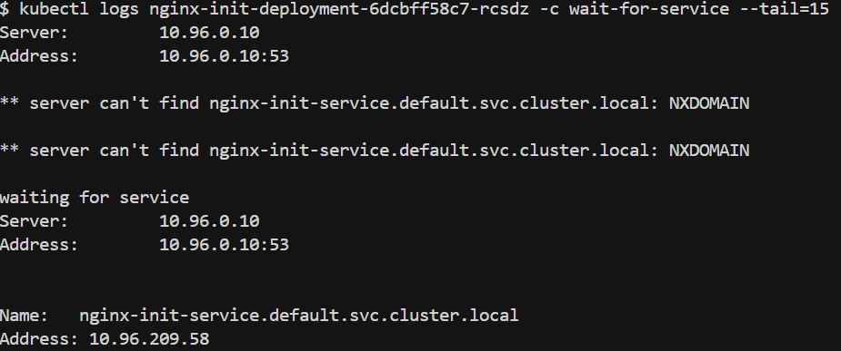